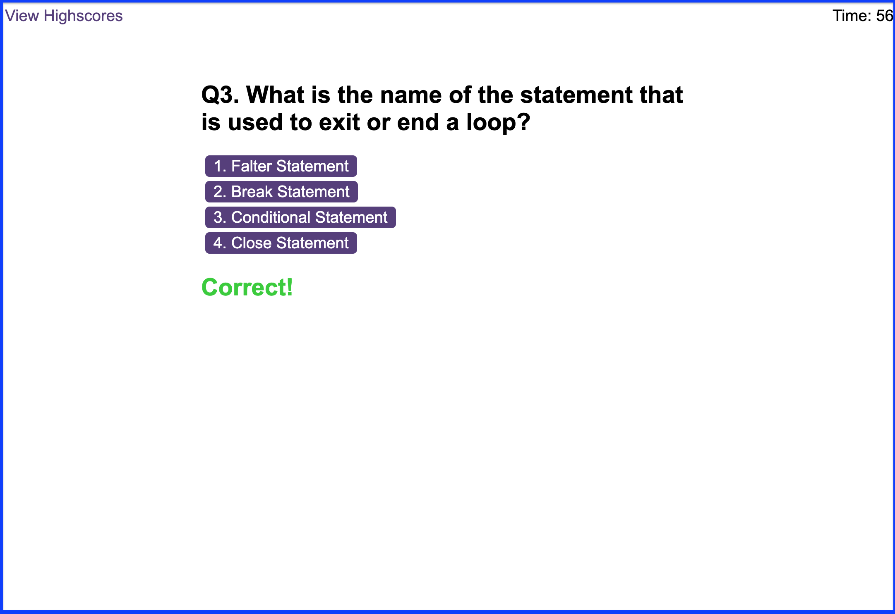

# Coding Quiz

## Description

In this project I was required to build a quiz centered around coding.

_Find the link to the the deployed website [here](https://prodigalprogrammer.github.io/password-generator/)_

(<a href="#coding-quiz" >Back to top</a>)

## Usage

Once the start button is clicked the quiz will start.

- Selecting a wrong answer will deducted 10 seconds from your timer.
- Selecting a right answer will add 5 points to your final score.
- As you play along, the timer will countdown to zero which will be the end of the game.
- There is also a possibility of answering all questions to end the game.

(<a href="#coding-quiz" >Back to top</a>)

## License

Distributed under the MIT License. See `LICENSE.txt` for more information.

## Contact

Project Link: [https://github.com/prodigalProgrammer/code-quiz](https://github.com/prodigalProgrammer/code-quiz)

Monrone Stewart: [YouTube](https://www.youtube.com/@ProdigalP) - prodigalprogrammer7@gmail.com

(<a href="#coding-quiz" >Back to top</a>)

## Acknowledgement

- [GitHub Pages](https://pages.github.com/)
- [The Complete JavaScript Course 2024: From Zero to Expert!](https://www.udemy.com/course/the-complete-javascript-course/)

(<a href="#coding-quiz" >Back to top</a>)

